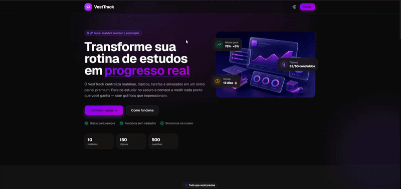
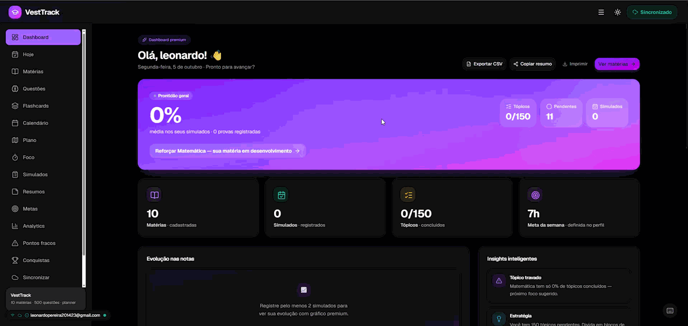

# VestTrack 🚀

**Transforme sua rotina de estudos em progresso real.**

Plataforma premium para organizar seus estudos pro vestibular. 10 matérias, 150 tópicos, 500 questões, flashcards, resumos, metas e analytics — tudo em um painel que motiva de verdade. 100% grátis e offline-first.

<p align="center">
  <a href="https://vest-track.vercel.app"></a>
  <a href="https://vest-track.vercel.app/app"></a>
</p>

<p align="center">
  
  
  
  
  
  
</p>

---

## ✨ Demonstração

**Live:** https://vest-track.vercel.app  
**App:** https://vest-track.vercel.app/app

### Landing Page


### Dashboard


### Fluxo principal

- **Landing** — Hero com gradiente violet→fuchsia, features, comparison (planilha vs VestTrack), how it works, testimonials e FAQ
- **Dashboard** — Progresso geral, streak, próximo foco, tarefas pendentes
- **Hoje** — Planner do dia, metas diárias, revisão de erros
- **Matérias** — 10 matérias com 15 tópicos cada, progresso visual, cores por matéria
- **Questões** — 500 questões ENEM/FUVEST/UNICAMP/UNESP 2018-2026, modo lista (Check + Limpar) e prática/quiz, atalhos 1-4, Enter, Esc
- **Flashcards & Resumos** — Revisão espaçada SRS
- **Metas & Analytics** — Streak 7 dias, metas diárias/semanais/mensais, evolução 30 dias, por matéria, heatmap 90 dias

---

## 🎯 O que tem

| Feature | Descrição |
|---------|-----------|
| 📚 **10 Matérias** | Matemática, Linguagens, Ciências e Humanas com 15 tópicos cada, cores distintas (Inglês=blue) |
| 🧠 **500 Questões** | 50 por matéria, nível difícil ENEM, com texto quando precisa, sem texto quando não precisa, gabarito + explicação + tags |
| 🃏 **Flashcards & Resumos** | SRS + resumos por tópico com tags |
| 🎯 **Metas & Streaks** | Sequência atual, recorde, XP 30d, % metas, últimos 7 dias, progresso nível |
| 📊 **Analytics** | Total questões, taxa acerto, esta semana, foco total, evolução 30 dias, por matéria, simulados, quando estuda, heatmap 90 dias |
| 📅 **Planner & Calendário** | Planeje por data, calendário mensal, plano de estudos |
| ⌨️ **Atalhos** | 1-4 ou A-D seleciona, Enter verifica (modo lista), Esc limpa, ? abre ajuda |
| 💾 **Offline-first** | Funciona 100% sem login, salva no localStorage. Nuvem opcional |
| 🎨 **Design Premium** | Apple/Linear style, violet→fuchsia, glass sutil, sidebar fixa sticky, mobile first 44px touch, sem animações intensas |

---

## 🚀 Stack

**Frontend:**
- React 18 + TypeScript 5 + Vite 8
- Tailwind CSS 4 + shadcn/ui + Lucide Icons
- React Router + Recharts + custom SVG charts
- localStorage source of truth, Supabase opcional

**Backend (opcional):**
- Supabase (Auth + Postgres + RLS)
- 10 tabelas: profiles, topic_progress, tasks, mock_tests, question_attempts, goals, streaks, daily_activity, flashcards_progress, summaries
- RLS: cada usuário só vê próprios dados

**Deploy:**
- Vercel (SPA rewrites)

---

## 📁 Estrutura

```
src/
├── components/
│   ├── ui/              # Card, Button, etc
│   ├── layout/          # Navbar, Sidebar (fixa sticky)
│   ├── questions/       # QuestionCard com Check/Limpar + atalhos
│   ├── Onboarding.tsx   # tutorial 4 steps, só 1x
│   ├── ShortcutsHelp.tsx # ? pra atalhos
│   └── SupabaseStatus.tsx # status online/offline + conta
├── pages/
│   ├── Landing.tsx      # hero, features, comparison, steps, testimonials, FAQ, CTA
│   ├── Dashboard.tsx    # progresso, streak, próximo foco
│   ├── Today.tsx        # planner hoje, metas, revisão erros
│   ├── Subjects.tsx     # 10 matérias grid
│   ├── SubjectDetails.tsx
│   ├── Questions.tsx    # lista + prática + quiz
│   ├── Flashcards.tsx, Summaries.tsx, MockTests.tsx
│   ├── Goals.tsx        # streak laranja + daily/weekly/monthly
│   ├── Analytics.tsx    # 30d, por matéria, heatmap
│   ├── Admin.tsx        # visitas Supabase, só admin
│   ├── Sync.tsx         # login/signup + debug env vars
│   └── Profile.tsx
├── data/
│   ├── subjects.ts      # 10 matérias com cores
│   ├── questions.ts     # 500 questões
│   ├── goals.ts, analytics.ts, mockTests.ts...
│   └── summaries.ts, flashcards.ts
├── lib/
│   ├── storage.ts, supabase.ts, sync.ts
│   ├── analytics.ts     # trackPageView + getVisitStats (unique)
│   └── utils.ts
└── router.tsx
```

---

## 🎯 Roadmap

- [x] 10 matérias + 150 tópicos + 500 questões difíceis
- [x] Flashcards + Resumos + Simulados + Hoje + Calendário
- [x] Metas & Streaks + Analytics + Tutor removido (ruim)
- [x] Atalhos teclado (1-4, Enter, Esc, ?) + Onboarding
- [x] Supabase sync + Visitas (pessoas únicas) + Admin restrito
- [x] Landing com testimonials + FAQ + README perfeito
- [x] Vercel deploy + Vercel Analytics
- [ ] Redação ENEM (temas 2018-2026, C1-C5, histórico)
- [ ] PWA opcional + notificações streak
- [ ] Exportar dados CSV/PDF + compartilhar progresso

---

## 🐛 Bug Fixes Recentes

- QuestionCard disabled após verificar (modo review)
- Calendar data local YYYY-MM-DD em vez de UTC (fuso Brasil)
- Goals progress NaN check
- Analytics maxHeat || 1
- Subjects tasks try/catch
- Onboarding/Shortcuts localStorage try/catch
- SupabaseStatus navigator check
- Sync debug env vars na Vercel

---

## 💜 Autor

**Leonardo Pereira** — 2024/2025  
Projeto pessoal pra organizar meus estudos e ajudar quem tá no vestibular. Open source, 100% grátis, sem pegadinha.

<p align="center">
  <a href="https://vest-track.vercel.app">🌐 Site</a> •
  <a href="https://vest-track.vercel.app/app">🚀 App</a> •
  <a href="https://github.com/Leuuo2/VestTrack">⭐ GitHub</a>
</p>

---

<p align="center">
  <strong>VestTrack — organize seus estudos, gabarite sua prova. 💜</strong>
</p>
